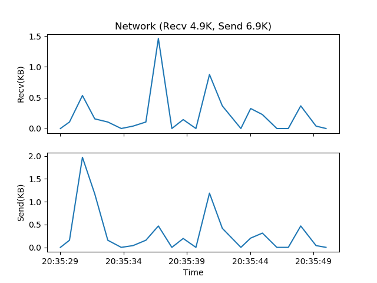
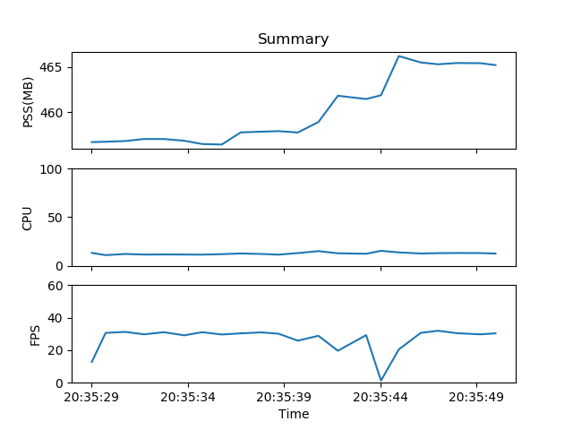

# Performance 性能采集
自动记录测试过程中的CPU，PSS, NET

使用方法

```python
import uiautomator2f as u2
import uiautomator2f.ext.perf as perf

package_name = "com.netease.cloudmusic"
u2.plugin_register('perf', perf.Perf)


def main():
    d = u2.connect()
    d.ext_perf.package_name = package_name
    d.ext_perf.csv_output = "perf.csv"  # 保存数据到perf.csv
    # d.debug = True # 采集到数据就输出，默认关闭
    # d.interval = 1.0 # 数据采集间隔，默认1.0s，尽量不要小于0.5s，因为采集内存比较费时间
    d.ext_perf.start()

    # run ... tests code here ...
    d.ext_perf.stop()  # 最好结束的时候调用下，虽然不调用也没多大关系

    # generate images from csv
    # 需要安装 matplotlib, pandas, numpy, humanize
    d.ext_perf.csv2images()


if __name__ == '__main__':
    main()
```

保存的csv文件内容格式为

```csv
time,package,pss,cpu,systemCpu,rxBytes,txBytes,fps
2018-09-11 20:35:29.016,com.tencent.tmgp.sgame,456.71,13.3,15.8,0,0,12.8
2018-09-11 20:35:29.733,com.tencent.tmgp.sgame,456.75,11.0,20.6,108,160,30.7
2018-09-11 20:35:30.756,com.tencent.tmgp.sgame,456.83,12.2,18.9,548,2021,31.3
2018-09-11 20:35:31.730,com.tencent.tmgp.sgame,457.05,11.6,19.1,160,1199,29.8
2018-09-11 20:35:32.759,com.tencent.tmgp.sgame,457.05,11.7,19.5,108,160,31.1
2018-09-11 20:35:33.821,com.tencent.tmgp.sgame,456.86,11.6,17.7,0,0,29.2
```

生成的图片为





`csv2images`函数更多的用法

```python
d.ext_perf.csv2images("perf.csv", target_dir="./")
```

数据项说明

- PSS直接通过`dumpsys meminfo <package-name>`获取
- CPU直接读取的`/proc/`下的文件计算出来的，多核的情况，数据是有可能超过100%的
- rxBytes, txBytes 目前只有wlan的流量，tcp和udp的流量总和
- fps 通过解析`dumpsys SurfaceFlinger --list` 和 `dumpsys SurfaceFlinger --latency <VIEW>` 计算出来

## 参考资料
- [Python CSV读写方法](https://python3-cookbook.readthedocs.io/zh_CN/latest/c06/p01_read_write_csv_data.html)
- [android屏幕刷新显示机制](https://blog.csdn.net/litefish/article/details/53939882)
- [Android FPS计算方法](https://www.jianshu.com/p/1fe9783d266b)
- [Github项目@leekinwa-androidTestTools_performance_FPS](https://github.com/leekinwa/androidTestTools_Performance_FPS)
- [官方proc文件格式资料](http://man7.org/linux/man-pages/man5/proc.5.html)
- [Chromium有关FPS的计算方法](https://github.com/ChromiumWebApps/chromium/blob/master/build/android/pylib/perf/surface_stats_collector.py)
- [FPS 计算方法的比较 by fenfenzhong](https://testerhome.com/topics/4643)
- [安卓性能测试之cpu占用率统计方法总结](https://www.jianshu.com/p/6bf564f7cdf0)
- [Android 性能测试实践 (四) 流量](https://testerhome.com/topics/2643)